# Execution Plan - 테이블오더 서비스

## Detailed Analysis Summary

### Change Impact Assessment
- **User-facing changes**: Yes - 고객 주문 UI, 관리자 모니터링 대시보드 신규 구축
- **Structural changes**: Yes - 전체 시스템 아키텍처 신규 설계 (React SPA + Express API + SQLite)
- **Data model changes**: Yes - 매장, 테이블, 메뉴, 주문, 세션 등 전체 데이터 모델 신규
- **API changes**: Yes - REST API + SSE 엔드포인트 전체 신규
- **NFR impact**: Yes - 성능, 보안, 기술 스택 선정 필요

### Risk Assessment
- **Risk Level**: Medium - 신규 프로젝트이나 검증된 기술 스택 사용
- **Rollback Complexity**: Easy - Greenfield, 롤백 필요 없음
- **Testing Complexity**: Moderate - 프론트엔드/백엔드/DB 통합 테스트 필요

---

## Workflow Visualization

```mermaid
flowchart TD
    Start(["User Request"])
    
    subgraph INCEPTION["INCEPTION PHASE"]
        WD["Workspace Detection<br/><b>COMPLETED</b>"]
        RA["Requirements Analysis<br/><b>COMPLETED</b>"]
        US["User Stories<br/><b>COMPLETED</b>"]
        WP["Workflow Planning<br/><b>COMPLETED</b>"]
        AD["Application Design<br/><b>COMPLETED</b>"]
        UG["Units Generation<br/><b>COMPLETED</b>"]
    end
    
    subgraph CONSTRUCTION["CONSTRUCTION PHASE"]
        FD["Functional Design<br/><b>EXECUTE</b>"]
        NFRA["NFR Requirements<br/><b>EXECUTE</b>"]
        NFRD["NFR Design<br/><b>EXECUTE</b>"]
        ID["Infrastructure Design<br/><b>EXECUTE</b>"]
        CG["Code Generation<br/><b>EXECUTE</b>"]
        BT["Build and Test<br/><b>EXECUTE</b>"]
    end
    
    Start --> WD
    WD --> RA
    RA --> US
    US --> WP
    WP --> AD
    AD --> UG
    UG --> FD
    FD --> NFRA
    NFRA --> NFRD
    NFRD --> ID
    ID --> CG
    CG --> BT
    BT --> End(["Complete"])

    style WD fill:#4CAF50,stroke:#1B5E20,stroke-width:3px,color:#fff
    style RA fill:#4CAF50,stroke:#1B5E20,stroke-width:3px,color:#fff
    style US fill:#4CAF50,stroke:#1B5E20,stroke-width:3px,color:#fff
    style WP fill:#4CAF50,stroke:#1B5E20,stroke-width:3px,color:#fff
    style AD fill:#4CAF50,stroke:#1B5E20,stroke-width:3px,color:#fff
    style UG fill:#4CAF50,stroke:#1B5E20,stroke-width:3px,color:#fff
    style FD fill:#FFA726,stroke:#E65100,stroke-width:3px,stroke-dasharray: 5 5,color:#000
    style NFRA fill:#FFA726,stroke:#E65100,stroke-width:3px,stroke-dasharray: 5 5,color:#000
    style NFRD fill:#FFA726,stroke:#E65100,stroke-width:3px,stroke-dasharray: 5 5,color:#000
    style ID fill:#FFA726,stroke:#E65100,stroke-width:3px,stroke-dasharray: 5 5,color:#000
    style CG fill:#4CAF50,stroke:#1B5E20,stroke-width:3px,color:#fff
    style BT fill:#4CAF50,stroke:#1B5E20,stroke-width:3px,color:#fff
    style INCEPTION fill:#BBDEFB,stroke:#1565C0,stroke-width:3px,color:#000
    style CONSTRUCTION fill:#C8E6C9,stroke:#2E7D32,stroke-width:3px,color:#000
    style Start fill:#CE93D8,stroke:#6A1B9A,stroke-width:3px,color:#000
    style End fill:#CE93D8,stroke:#6A1B9A,stroke-width:3px,color:#000
    linkStyle default stroke:#333,stroke-width:2px
```



### Text Alternative
```
Phase 1: INCEPTION (ALL COMPLETED)
- Workspace Detection (COMPLETED)
- Requirements Analysis (COMPLETED)
- User Stories (COMPLETED)
- Workflow Planning (COMPLETED)
- Application Design (COMPLETED)
- Units Generation (COMPLETED)

Phase 2: CONSTRUCTION (per-unit)
- Functional Design (EXECUTE)
- NFR Requirements (EXECUTE)  <-- ADDED
- NFR Design (EXECUTE)        <-- ADDED
- Infrastructure Design (EXECUTE) <-- ADDED
- Code Generation (EXECUTE)
- Build and Test (EXECUTE)
```

---

## Phases to Execute

### INCEPTION PHASE
- [x] Workspace Detection (COMPLETED)
- [x] Requirements Analysis (COMPLETED)
- [x] User Stories (COMPLETED)
- [x] Workflow Planning (COMPLETED)
- [x] Application Design (COMPLETED)
- [x] Units Generation (COMPLETED)

### CONSTRUCTION PHASE (per-unit)
- [ ] Functional Design - **EXECUTE**
  - **Rationale**: 주문 라이프사이클, 세션 관리, 상태 전이 등 복잡한 비즈니스 로직에 대한 상세 설계 필요
- [ ] NFR Requirements - **EXECUTE** (추가됨)
  - **Rationale**: 성능 요구사항(SSE 2초 이내), 보안(JWT/bcrypt/Rate Limit), 사용성(터치 UI) 요건 분석 필요
- [ ] NFR Design - **EXECUTE** (추가됨)
  - **Rationale**: NFR Requirements 기반 기술 패턴 설계 (SSE 구현 패턴, 인증 흐름, 에러 처리 전략)
- [ ] Infrastructure Design - **EXECUTE** (추가됨)
  - **Rationale**: 서버/클라이언트 프로젝트 구조, 빌드 설정, 개발 환경 구성 설계
- [ ] Code Generation - **EXECUTE** (ALWAYS)
  - **Rationale**: 실제 코드 구현 필수
- [ ] Build and Test - **EXECUTE** (ALWAYS)
  - **Rationale**: 빌드 및 테스트 지침 생성 필수

### OPERATIONS PHASE
- [ ] Operations - PLACEHOLDER
  - **Rationale**: 향후 배포/모니터링 워크플로우 확장용

---

## Per-Unit Execution Flow

각 Unit은 다음 순서로 실행:
```
Functional Design → NFR Requirements → NFR Design → Infrastructure Design → Code Generation
```

| Unit | 담당 | 실행 단계 |
|------|------|----------|
| Unit 0: Foundation | Dev 1 | FD → NFRA → NFRD → ID → CG |
| Unit 1: 인증+메뉴 | Dev 1 | FD → NFRA → NFRD → ID → CG |
| Unit 2: 주문+모니터링 | Dev 2 | FD → NFRA → NFRD → ID → CG |
| Unit 3: 테이블관리 | Dev 3 | FD → NFRA → NFRD → ID → CG |
| Build and Test | 전원 | 통합 테스트 |

---

## Success Criteria
- **Primary Goal**: 고객이 태블릿에서 메뉴 조회/주문, 관리자가 실시간 모니터링/관리 가능한 MVP 완성
- **Key Deliverables**: React SPA (고객+관리자), Express API 서버, SQLite 데이터베이스, SSE 실시간 통신
- **Quality Gates**: 모든 사용자 스토리의 수용 기준 충족, API 엔드포인트 동작 확인, SSE 실시간 업데이트 동작 확인
